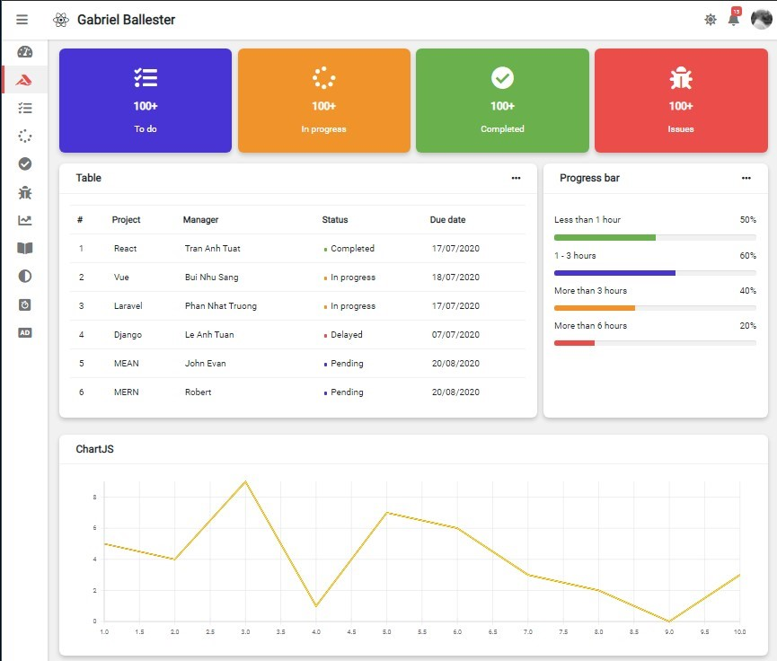
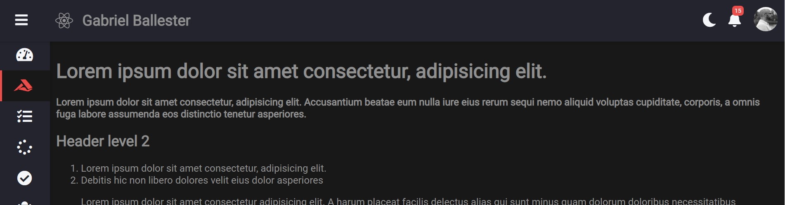
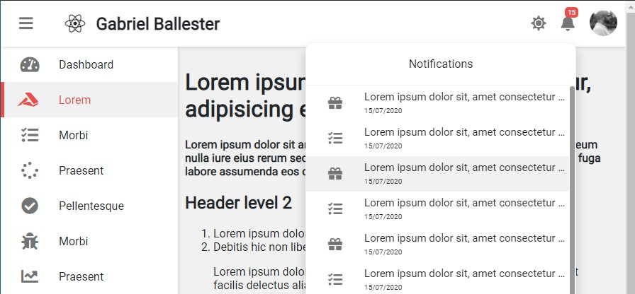
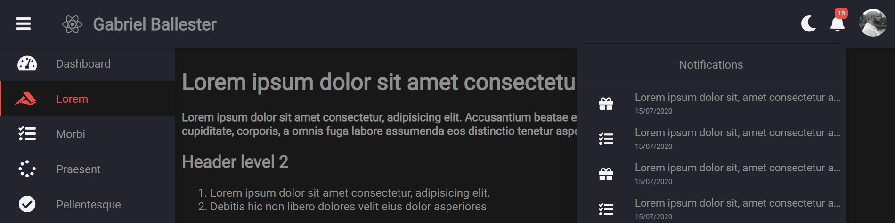
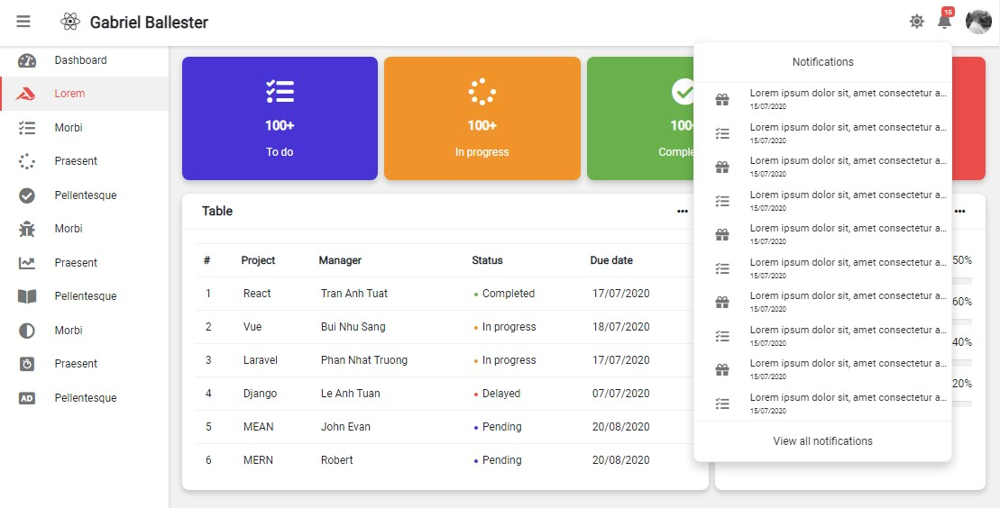
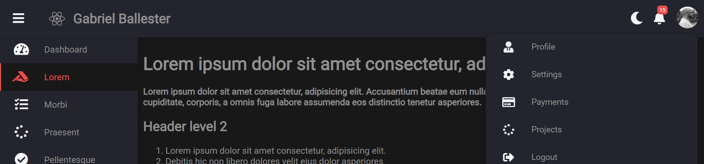
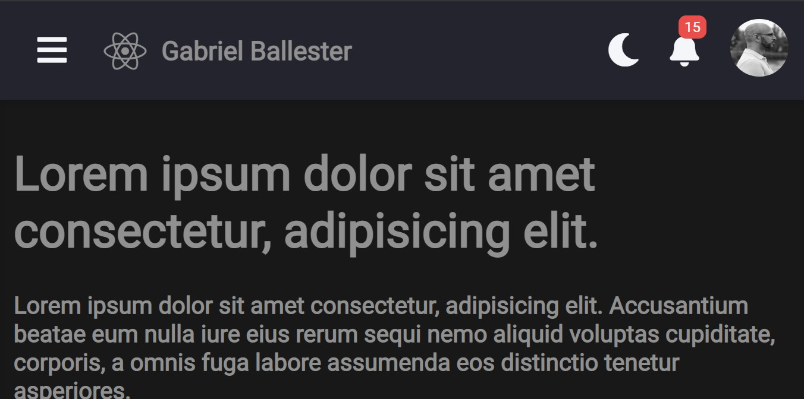
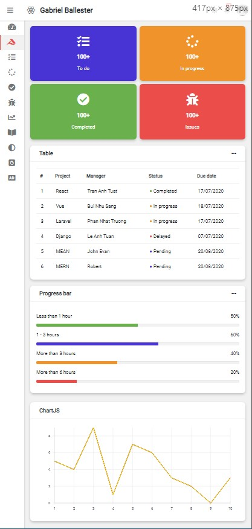
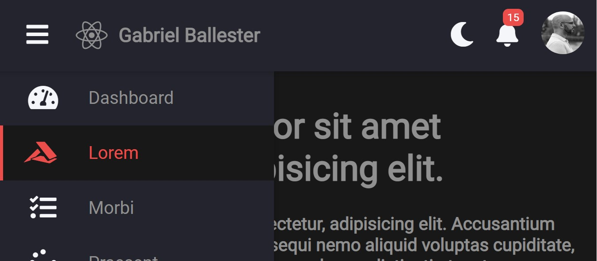

# React panel de administración v3 Dark / light mode + sidebar ocultable
Panel de administración css con switch dark / light mode + sidebar ocultable.
Dropdowns de notificaciones y configuración, para acceso a más opciones.
## Tecnologías usadas:
- React
- CSS Grid
- Light / dark mode con useState y props
- Sidebar ocultable con useState y props

## Instalar dependencias
`yarn install`

## Arrancar servidor
`yarn start`

Arranca en modo desarrollo
Abre [http://localhost:3000](http://localhost:3000) para mostrar el diseño

## Capturas
### - Escritorio

### - Escritorio dark mode

### - Menús desplegados

### - Menús desplegados dark mode

### - Settings desplegado

### - Settings desplegado dark mode

### - Móvil plegado

### - Móvil plegado dark mode

### - Móvil desplegado

### - Móvil desplegado dark mode

