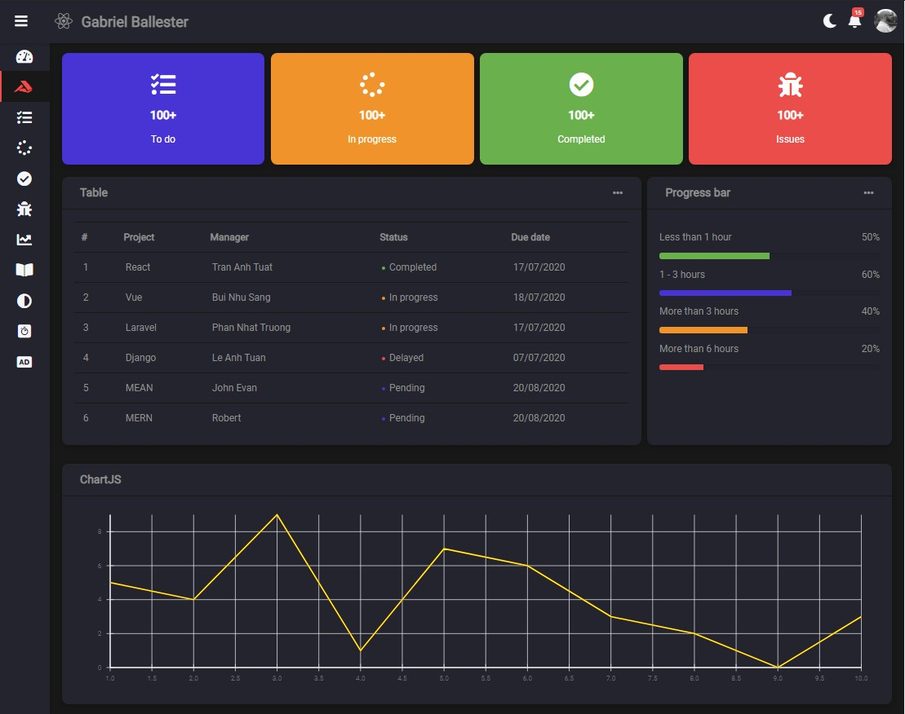
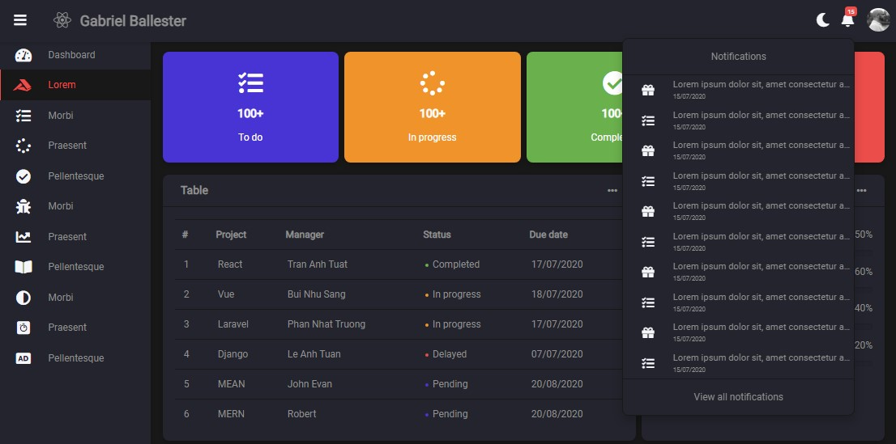

# React panel de administración v3 Dark / light mode + sidebar ocultable
Panel de administración css con switch dark / light mode + sidebar ocultable.
Dropdowns de notificaciones y configuración, para acceso a más opciones.
## Tecnologías usadas:
- React
- CSS Grid
- Light / dark mode con useState y props
- Sidebar ocultable con useState y props

## Instalar dependencias
`yarn install`

## Arrancar servidor
`yarn start`

Arranca en modo desarrollo
Abre [http://localhost:3000](http://localhost:3000) para mostrar el diseño

## Capturas
### - Desktop light

### - Desktop dark

### - Menús desplegados light

### - Menús desplegados dark mode

### - Tablet light

### - Tablet dark

### - Móvil dark

## Mejoras
- Se puede implementar context para cerrar menús desde cualquier parte de la web